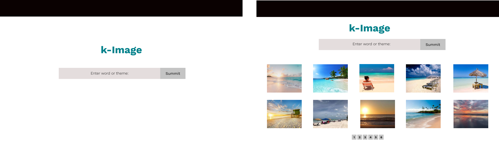

# kImage

# OVERVIEW
k-Image, used to display images.

## Project Developer

Created, designed, and developed by [Kay Chan](https://github.com/kaych26)

## Project Description

k-Image is an applicaton to display images based on the user's input.  The user enters a word or theme, the application uses the Pixabay API to retrieve 80 images and display the thumbnails images.  The full size image will be displayed in a modal when user clicks on the thumbnail image.

## To execute the App
In the root directory, run 'npm i && npm start'.  
The npm i will install http-server and app will executed on port localhost 3000.

# UNIT TESTING
Dependencies: Jest
To Run: 
  On file main.js, the last line (module.exports) needs to be uncommented.
  At Root Directory:  npm test

# DESIGN
The application is built using JavaScript, HTML and CSS.  
The JavaScript front-end is responsive on Chrome. 
Uses Pixabay API to retrieve images.

### Wireframes

