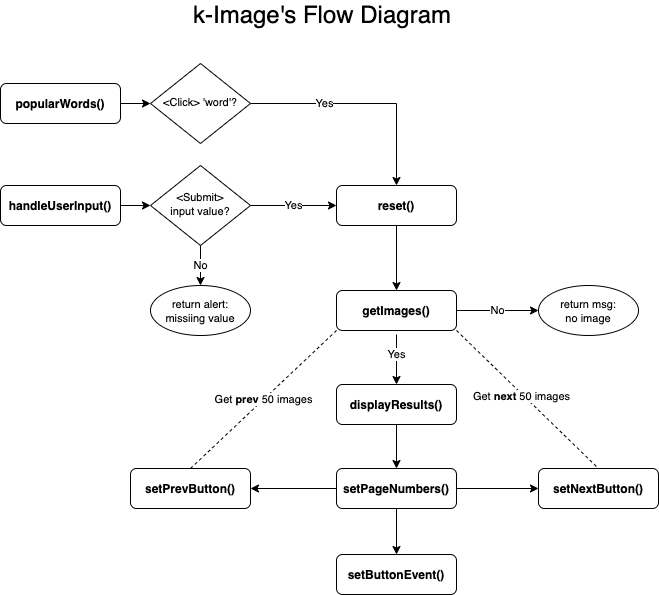

# k-Image - https://k-image.netlify.app/

# Overview
## Developer
Kay Chan

## Exercise
- Retrieve a list of at least 50 images and display them as thumbnails on a page.
- Paginate thumbnails by 10 thumbnails per page.
- When clicking on an image, it should display on a modal.
- All images should be about a specific theme or based on a specific word.

# RUN the App
## Execute:
On the root directory
  - npm i && start

## Note:
  - npm i will install dependencies:  
  - http-server => webserver
  - jest-cli  => run jest for unit testing

npm start => runs the app on http-server using port 3000

## Unit Testing:
Tool used: Jest

- At root directory: In 'main.js', uncommnet the last line (exports).  The export is commented out to run js website. Further research is needed to handle the export.

- At root directory -> run 'npm test'

## Wireframes

# DESIGN
- The application is built using JavaScript, HTML and CSS. 
- The 'Pixabay API' is connected to retrieve images.
- User enters word or select highlighted word to retrieve images.
- Each API call retrieves 50 images.
- Display 10 thumbnails per page - 5 buttons or less (if less images) .
- The'Prev' and 'Next' buttons to retrieve the next or prev 50 images (up to 50 pages, 500 images).
- Current button is highlighted.
- When user clicks on thumbnail, modal with large image is displayed. 'X' to close modal.
- The image is displayed using 'flex' css and reponsive as the screen width shrinks.

## Files:
  ./index.hmtl   
  ./src/main.js  
  ./src/main.css

## Jest Test files
  ./src/main.test.js

## Functions
- popularWords() => Populate a list of popular words and retrieve the images when clicked
- handleUserInput() => Execute the image retrieve based on user's input
- reset() => Resets the initial variables back to original state when new input is requested
- getImages() => Call pixabay API to retrieve the first 50 images
- displayResults() => Read results and update DOM.  Display the first page of 10 image thumbnails. Create listener to display image modal if thumbnail is clicked.
- setPageNumber() => Paginate the results, 10 images per page.  Display buttons for each page with current page highlighted.
- setNextButton() => Create the next button to allow user to retrieve the next 50 images (upto 50th pages, total 500 images), will not display if max images are retrieved.
- setPrevButton() => Similar to next button, it goes back to the previous 50 images, only displayed from page 6 and on. 
- closeModal() => Event listener to close image modal.
- setButtonEvent() => Event listener to diplay the images for selected page.
- calcTotalPages() => Calculate total number of buttons. If images is less than 50, then fewer buttons.
- calcArrIdx() => Calculate the index range of 10 images to reference from the response array.

## Wireframes

# POST MVP
- Make a cover page.
- Add the next option to display the next image on the modal screen.
- Add filter image by categories option (background, sports, business, etc.
- Add fitler image by color.
- Build image slide show option.
